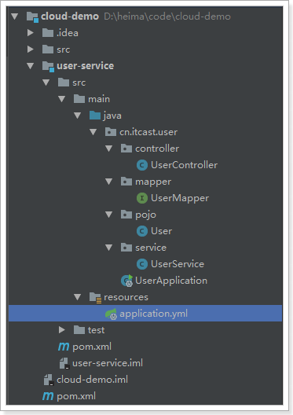
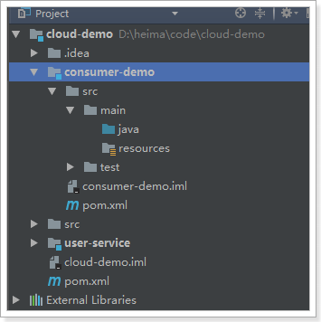
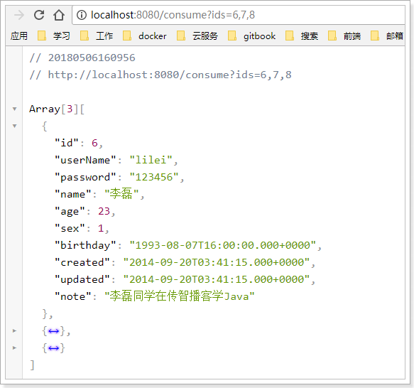
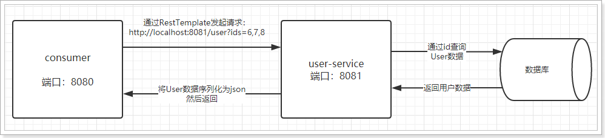

# 5.微服务场景模拟

首先，我们需要模拟一个服务调用的场景。方便后面学习微服务架构

## 5.1.创建父工程


编写项目信息：

 

编写保存位置：


然后将Pom修改成这样：

```xml
<?xml version="1.0" encoding="UTF-8"?>
<project xmlns="http://maven.apache.org/POM/4.0.0"
         xmlns:xsi="http://www.w3.org/2001/XMLSchema-instance"
         xsi:schemaLocation="http://maven.apache.org/POM/4.0.0 http://maven.apache.org/xsd/maven-4.0.0.xsd">
    <modelVersion>4.0.0</modelVersion>

    <groupId>cn.itcast.demo</groupId>
    <artifactId>cloud-demo</artifactId>
    <version>1.0-SNAPSHOT</version>
    <packaging>pom</packaging>

    <parent>
        <groupId>org.springframework.boot</groupId>
        <artifactId>spring-boot-starter-parent</artifactId>
        <version>2.0.1.RELEASE</version>
        <relativePath/>
    </parent>

    <properties>
        <project.build.sourceEncoding>UTF-8</project.build.sourceEncoding>
        <project.reporting.outputEncoding>UTF-8</project.reporting.outputEncoding>
        <java.version>1.8</java.version>
        <spring-cloud.version>Finchley.RC1</spring-cloud.version>
        <mybatis.starter.version>1.3.2</mybatis.starter.version>
        <mapper.starter.version>2.0.2</mapper.starter.version>
        <druid.starter.version>1.1.9</druid.starter.version>
        <mysql.version>5.1.32</mysql.version>
        <pageHelper.starter.version>1.2.3</pageHelper.starter.version>
        <leyou.latest.version>1.0.0-SNAPSHOT</leyou.latest.version>
    </properties>

    <dependencyManagement>
        <dependencies>
            <!-- springCloud -->
            <dependency>
                <groupId>org.springframework.cloud</groupId>
                <artifactId>spring-cloud-dependencies</artifactId>
                <version>${spring-cloud.version}</version>
                <type>pom</type>
                <scope>import</scope>
            </dependency>
            <!-- mybatis启动器 -->
            <dependency>
                <groupId>org.mybatis.spring.boot</groupId>
                <artifactId>mybatis-spring-boot-starter</artifactId>
                <version>${mybatis.starter.version}</version>
            </dependency>
            <!-- 通用Mapper启动器 -->
            <dependency>
                <groupId>tk.mybatis</groupId>
                <artifactId>mapper-spring-boot-starter</artifactId>
                <version>${mapper.starter.version}</version>
            </dependency>
            <!-- 分页助手启动器 -->
            <dependency>
                <groupId>com.github.pagehelper</groupId>
                <artifactId>pagehelper-spring-boot-starter</artifactId>
                <version>${pageHelper.starter.version}</version>
            </dependency>
            <!-- mysql驱动 -->
            <dependency>
                <groupId>mysql</groupId>
                <artifactId>mysql-connector-java</artifactId>
                <version>${mysql.version}</version>
            </dependency>
        </dependencies>
    </dependencyManagement>

    <build>
        <plugins>
            <plugin>
                <groupId>org.springframework.boot</groupId>
                <artifactId>spring-boot-maven-plugin</artifactId>
            </plugin>
        </plugins>
    </build>

    <repositories>
        <repository>
            <id>spring-milestones</id>
            <name>Spring Milestones</name>
            <url>https://repo.spring.io/milestone</url>
            <snapshots>
                <enabled>false</enabled>
            </snapshots>
        </repository>
    </repositories>
</project>
```

这里已经对大部分要用到的依赖的版本进行了 管理，方便后续使用


## 5.2.服务提供者

我们新建一个项目，对外提供查询用户的服务。

### 5.2.1.创建module


### 5.2.2.依赖

```xml
<?xml version="1.0" encoding="UTF-8"?>
<project xmlns="http://maven.apache.org/POM/4.0.0"
         xmlns:xsi="http://www.w3.org/2001/XMLSchema-instance"
         xsi:schemaLocation="http://maven.apache.org/POM/4.0.0 http://maven.apache.org/xsd/maven-4.0.0.xsd">
    <parent>
        <artifactId>cloud-demo</artifactId>
        <groupId>cn.itcast.demo</groupId>
        <version>1.0-SNAPSHOT</version>
    </parent>
    <modelVersion>4.0.0</modelVersion>

    <groupId>cn.itcast.demo</groupId>
    <artifactId>user-service</artifactId>
    <version>1.0-SNAPSHOT</version>

    <dependencies>
        <dependency>
            <groupId>org.springframework.boot</groupId>
            <artifactId>spring-boot-starter-web</artifactId>
        </dependency>
        <dependency>
            <groupId>org.mybatis.spring.boot</groupId>
            <artifactId>mybatis-spring-boot-starter</artifactId>
        </dependency>
        <dependency>
            <groupId>mysql</groupId>
            <artifactId>mysql-connector-java</artifactId>
        </dependency>
        <dependency>
            <groupId>tk.mybatis</groupId>
            <artifactId>mapper-spring-boot-starter</artifactId>
        </dependency>
    </dependencies>
</project>
```


项目结构：

 


### 5.1.2.编写代码

添加一个对外查询的接口：

```java
@RestController
@RequestMapping("user")
public class UserController {

    @Autowired
    private UserService userService;

    @GetMapping("/{id}")
    public User queryById(@PathVariable("id") Long id) {
        return this.userService.queryById(id);
    }
}
```

Service：

```java
@Service
public class UserService {

    @Autowired
    private UserMapper userMapper;

    public User queryById(Long id) {
        return this.userMapper.selectByPrimaryKey(id);
    }
}
```

mapper:

```java
public interface UserMapper extends tk.mybatis.mapper.common.Mapper<User>{
}
```

实体类：

```java
@Table(name = "tb_user")
public class User implements Serializable {

    private static final long serialVersionUID = 1L;

    @Id
    @GeneratedValue(strategy = GenerationType.IDENTITY)
    private Long id;

    // 用户名
    private String userName;

    // 密码
    private String password;

    // 姓名
    private String name;

    // 年龄
    private Integer age;

    // 性别，1男性，2女性
    private Integer sex;

    // 出生日期
    private Date birthday;

    // 创建时间
    private Date created;

    // 更新时间
    private Date updated;

    // 备注
    private String note;

   // 。。。省略getters和setters
}

```

属性文件,这里我们采用了yaml语法，而不是properties：

```yaml
server:
  port: 8081
spring:
  datasource:
    url: jdbc:mysql://localhost:3306/mydb01
    username: root
    password: 123
mybatis:
  type-aliases-package: cn.itcast.user.pojo
```

启动类：

```java
@SpringBootApplication
public class UserApplication {
    public static void main(String[] args) {
        SpringApplication.run(UserApplication.class, args);
    }
}
```

项目结构：

 

### 5.1.3.启动并测试：

启动项目，访问接口：http://localhost:8081/user/7

 


## 5.2.服务调用者

### 5.2.1.创建工程

与上面类似，这里不再赘述，需要注意的是，我们调用user-service的功能，因此不需要mybatis相关依赖了。


pom：

```xml
<?xml version="1.0" encoding="UTF-8"?>
<project xmlns="http://maven.apache.org/POM/4.0.0"
         xmlns:xsi="http://www.w3.org/2001/XMLSchema-instance"
         xsi:schemaLocation="http://maven.apache.org/POM/4.0.0 http://maven.apache.org/xsd/maven-4.0.0.xsd">
    <parent>
        <artifactId>cloud-demo</artifactId>
        <groupId>cn.itcast.demo</groupId>
        <version>1.0-SNAPSHOT</version>
    </parent>
    <modelVersion>4.0.0</modelVersion>

    <groupId>cn.itcast.demo</groupId>
    <artifactId>consumer-demo</artifactId>
    <version>1.0-SNAPSHOT</version>

    <dependencies>
        <dependency>
            <groupId>org.springframework.boot</groupId>
            <artifactId>spring-boot-starter-web</artifactId>
        </dependency>
        <!-- 添加OkHttp支持 -->
        <dependency>
            <groupId>com.squareup.okhttp3</groupId>
            <artifactId>okhttp</artifactId>
            <version>3.9.0</version>
        </dependency>
    </dependencies>
</project>
```


结构：

 


### 5.2.2.编写代码

首先在启动类中注册`RestTemplate`：

```java
@SpringBootApplication
public class ConsumerDemoApplication {

    @Bean
    public RestTemplate restTemplate() {
        // 这次我们使用了OkHttp客户端,只需要注入工厂即可
        return new RestTemplate(new OkHttp3ClientHttpRequestFactory());
    }

    public static void main(String[] args) {
        SpringApplication.run(ConsumerDemoApplication.class, args);
    }
}
```


然后编写UserDao，注意，这里不是调用mapper查数据库，而是通过RestTemplate远程查询user-service-demo中的接口：

```java
@Component
public class UserDao {

    @Autowired
    private RestTemplate restTemplate;

    public User queryUserById(Long id){
        String url = "http://localhost:8081/user/" + id;
        return this.restTemplate.getForObject(url, User.class);
    }
}
```


然后编写user-service，循环查询UserDAO信息：

```java
@Service
public class UserService {

    @Autowired
    private UserDao userDao;

    public List<User> querUserByIds(List<Long> ids){
        List<User> users = new ArrayList<>();
        for (Long id : ids) {
            User user = this.userDao.queryUserById(id);
            users.add(user);
        }
        return users;
    }
}
```

编写controller：

```java
@RestController
@RequestMapping("consume")
public class ConsumerController {

    @Autowired
    private UserService userService;

    @GetMapping
    public List<User> consume(@RequestParam("ids") List<Long> ids) {
        return this.userService.queryUserByIds(ids);
    }
}
```


### 5.2.3.启动测试：

因为我们没有配置端口，那么默认就是8080，我们访问：http://localhost:8080/consume?ids=6,7,8

 

一个简单的远程服务调用案例就实现了。

## 5.3.有没有问题？

简单回顾一下，刚才我们写了什么：

- use-service-demo：一个提供根据id查询用户的微服务
- consumer-demo：一个服务调用者，通过RestTemplate远程调用user-service-demo

流程如下：



存在什么问题？

- 在consumer中，我们把url地址硬编码到了代码中，不方便后期维护
- consumer需要记忆user-service的地址，如果出现变更，可能得不到通知，地址将失效
- consumer不清楚user-service的状态，服务宕机也不知道
- user-service只有1台服务，不具备高可用性
- 即便user-service形成集群，consumer还需自己实现负载均衡

其实上面说的问题，概括一下就是分布式服务必然要面临的问题：

- 服务管理
  - 如何自动注册和发现
  - 如何实现状态监管
  - 如何实现动态路由
- 服务如何实现负载均衡
- 服务如何解决容灾问题
- 服务如何实现统一配置

以上的问题，我们都将在SpringCloud中得到答案。